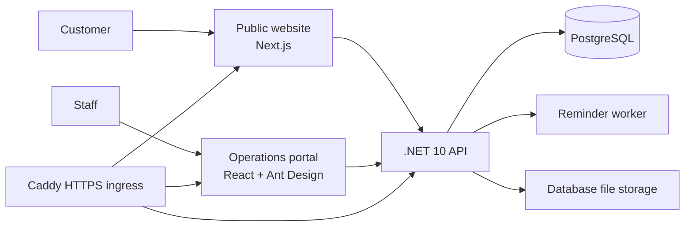

# YS Heng Platform


Used-car sales software for YS Heng. The platform combines a public vehicle catalogue, an internal operations portal, workflow controls, and a Docker-based deployment path.


## What is included

| Area | Purpose | Technology |
| --- | --- | --- |
| Public website | Vehicle browsing, bilingual content, vehicle details, and enquiries | Next.js, React, TypeScript |
| Operations portal | Inventory, repairs, loans, delivery, finance, leads, audit, HR, and administration | Vite, React, Ant Design |
| API | Business rules, authentication, role policies, uploads, reminders, and audit logging | .NET 10, EF Core, PostgreSQL |
| Infrastructure | Local Compose, VPS deployment, health checks, smoke tests, and backups | Docker Compose, Caddy, PowerShell, Bash |

## Architecture



For the detailed service map and deployment shape, see [the architecture guide](docs/ARCHITECTURE.md).

## Quick start

### Requirements

- Node.js compatible with the checked-in lockfile
- .NET SDK `10.0.100` or a compatible feature roll-forward
- Docker Desktop with the Linux engine, or PostgreSQL 17 for the clean local smoke runner
- Windows PowerShell for the included infrastructure scripts

### Install and run checks

```powershell
npm install
npm run lint
npm run build
npm --workspace apps/frontoffice run test
npm --workspace apps/backoffice run test
dotnet test services\api\YSHeng.sln
```

Run the complete local verification gate:

```powershell
.\infra\verify-local.ps1
```

The gate covers web checks, API tests, deployment contracts, environment validation, production builds, and the clean local smoke stack. Docker Compose runtime verification requires a responding Docker engine.

### Local services

| Service | URL |
| --- | --- |
| Public website | `http://localhost:3000` |
| Operations portal | `http://localhost:3001` |
| API | `http://localhost:5000` |

For local Docker usage, copy `infra/compose.env.local.example` to `.env`, then follow the [deployment runbook](docs/DEPLOYMENT_RUNBOOK.md).

## Documentation

- [Architecture](docs/ARCHITECTURE.md)
- [Implementation status](docs/IMPLEMENTATION.md)
- [API and role-policy reference](docs/API.md)
- [Deployment runbook](docs/DEPLOYMENT_RUNBOOK.md)
- [Requirements trace](docs/REQUIREMENTS_TRACE.md)
- [SEO and measurement notes](docs/SEO_GEO_MEASUREMENT.md)
- [Source requirements cross-check](docs/SOURCE_REQUIREMENTS_CROSSCHECK.md)

## Project status

This repository contains the current YS Heng MVP implementation and its deployment tooling. Business rules, public-data boundaries, role policies, upload limits, and deployment assumptions are documented and covered by focused tests or contract checks.

Production deployment is manual-dispatch and environment-approval gated. A successful CI run proves the verification jobs; production completion additionally requires the deployment job and HTTPS smoke checks to pass.

## Security and operations

- Public routes are kept under `/api/public/*` and expose only public vehicle and enquiry data.
- Back-office routes use ASP.NET Identity authentication and role policies.
- Finance operations require the Finance policy.
- Vehicle photos are limited to 5 MB and documents to 10 MB.
- Production credentials belong in protected environment configuration, never in source control.
- PostgreSQL backups are part of the VPS operating routine because uploaded files are stored with the application data.

See the [deployment runbook](docs/DEPLOYMENT_RUNBOOK.md) for environment setup, backups, restore procedures, and production verification.

## License

The repository does not currently declare an open-source license. Add an explicit license or proprietary-use notice before distributing the code outside the project team.
